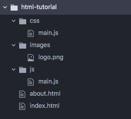

# Encoding in HTML

<iframe width="725" height="408" src="https://www.youtube.com/embed/9Yoykv7iFFg" frameborder="0" allow="accelerometer; autoplay; encrypted-media; gyroscope; picture-in-picture" allowfullscreen></iframe>

## History of HTML

- Invented by Tim Berners-Lee
- Created "hypertext" to share scientific papers
- First web page August 6, 1991
- Standardized by w3 Consortium

### Timeline

- HyperText Markup Language in Early 90s
- HTML 4 in 1997
- XHTML in 2000
- HTML 5 in 2014

## Terms

- **Web design**: The process of planning, structuring and creating a website
- **Web development**: The process of programming dynamic web applications
- **Front end**: The outwardly visible elements of a website or application
- **Back end**: The inner workings and functionality of a website or application.

### Web pages

- **HTML**: Structure
- **CSS**: Presentation
- **Javascript**: Interactivity

## Folder structure

File names are case sensitive and should not include spaces or special characters.



## HTML is text

HTML files are plain text files, so you can edit them in any text editor, but there are several editors that are designed for web development. I recommend using Visual Studio Code (VSCode) for this tutorial. It's free, available on all platforms, and has all of the features you need already built-in.

To start this tutorial, create a folder somewhere in your computer (I suggest `/Users/{username}/Sites/imt549/encoding-html`), and open that folder using VSCode. Choose the File menu and then choose Open.... Find the folder you created, select the folder, and choose the Open button.

From the File menu again, choose New File, and save that new file with the name index.html inside the folder you opened. By giving it the file extension .html you have told VSCode that this is an HTML file, so it will give you the correct syntax coloring and features.

The name index.html is special on the web. When a web browser asks a web server for a path that points to a folder, the web server will look for a file named index.html and return it to the browser if it exists. This is considered the "home page" for the folder.

## HTML documents start with a doctype declaration

HTML files start with a document type declaration, commonly referred to as the " doctype." The HTML version 5 document type declaration is really simple. Enter this as the first line of your HTML file:

```html
<!DOCTYPE html>
```

That tells any program that reads this file to interpret the contents as HTML version 5 syntax. As the version number implies, there have been several versions of HTML already, and not all of them used the exact same syntax. Thankfully for you, HTML5 is now the current standard and it's syntax is simple and straightforward.

## HTML is a tree of elements

The rest of an HTML document is a simple tree of elements. If you've taken a second-level computer science course, you should already know what a tree data structure is, but if you haven't (or if you forgot), a tree is a very common data structure that looks like this:


Image source: [http://www.openbookproject.net/tutorials/getdown/css/lesson4.html](http://www.openbookproject.net/tutorials/getdown/css/lesson4.html)

Each of those blue rectangles is known as a node. Each node has a parent node, except for the one at the top of the tree, which is known as the root node. Each node may have one or more child nodes, and those children can have children of their own (and so on, and so on). A node with no children is known as a leaf node.

These tree data structures are used all of the place in computer software. For example, the way your computer stores and organizes files is a tree structure: files exist within folders, which can exist within other folders, and so on, and so on. Files are leaf nodes and the folder that has no parent folder (e.g., the c: drive on Windows or the root folder on a Unix system) is a root note.

## HTML syntax

The nodes in an HTML document tree are known as elements. An element has the following syntax:

```html
<element-name>...some content...</element-name>
```

### Start and end tags

An element is composed of a start tag and end tag and some content in between. The start tag is this bit:

```html
<element-name>
```

The element-name part will be whatever the element's name is: for example, html, head, body, h1, p. There are lots of elements defined in HTML, and each communicates something about the content inside of the element.

The end tag looks just like the start tag, except it has a forward-slash just after the less-than sign:

```html
</element-name>
```

That marks the end of the element. What goes in between is the element's content, which can be plain text, other elements, or a mixture of both. For example, a paragraph element might have some text as well as other elements to emphasize specific words within the paragraph:

```html
<p>I really want to <em>emphasize</em> that last point!</p>
```

I really want to emphasize that last point!

The `<em>` element is used for content that is emphasized, and it can be nested inside lots of other elements. Although browsers typically render emphasized text in italics, you shouldn't think of that element as "the italics tag." Instead, think of it as a tag that tells the program reading this page that the text inside is emphasized. We can use CSS to format that emphasized text any way we want, so we use elements like `<em>` to denote the function that text plays.

### Attributes

The start tag of an element may also contain one or more attributes, which are used to specify options, provide additional information, or add subtler shades of meaning to an element. Attributes go inside the start tag, and look like this:

```html
<p lang="en" class="alert">...some content...</p>
```

The syntax for attributes is a name, followed by an equal sign, followed by a value in double-quotes. If there are multiple attributes, they are separated by spaces. The HTML standard defines several global attributes that can be used on any element, and many elements also define their own attributes that are particular to that element. The lang attribute shown in the previous example is a global one used to indicate the language in which the element's content is written. Programs reading this file use that to properly index the content, correctly pronounce it via a screen reader, or even translate it into another language.

### Self-closing elements

A few HTML elements don't require a separate end-tag because they can't contain any child elements or other textural content. A great example is the  element, which is used for inserting images into the page. You can specify the path to the image file in an attribute named src, but the image element itself can't contain additional text or other content. In these cases, all you need to include is the start tag:

```html

```

These are known as self-closing elements. You may also see these kinds of elements with a forward slash included before the ending greater-than sign. This was required by previous versions of HTML (especially in XHTML), but in HTML5 it's totally optional. Some purists will still insist that you include it, and if you do, it looks like this:

```html

```

But again, this is no longer required in HTML5, so feel free to omit that forward slash.

### Comments

Besides doctype declarations, elements, and attributes, the only other legal syntax in an HTML file is a comment, which looks like this:

```html
<!-- this is a comment -->
```

Comments are ignored by the browser, so they can serve two purposes: documentation to help you or other developers understand some section of the page; or as a quick way to tell the browser to temporarily ignore a block of HTML that is causing you troubles.

Since the syntax is quite awkward to type, most web-optimized editors have a built-in keystroke that will toggle the current line as a comment. Try hitting Cmd + / ( Ctrl + / on Windows). It should make the line a comment, and then make it not a comment the next time you use the same keystroke.

## Overall document structure

Now that you understand the basic HTML syntax, let's see how they combine to create a basic page. As we noted earlier, every page begins with the HTML5 doctype declaration, and the rest is a tree of elements containing content. The root element is named `<html>` and it should contain two child elements: `<head>` and `<body>`. Add this to your page:

```html
<!DOCTYPE html>
<html lang="en">
<head>

</head>
<body>

</body>
</html>
```

### The `<head>` section

The `<head>` element contains information about the page that doesn't appear in the main content window when viewing the page in the browser. For example, we can specify the title of the page here:

```html
<!DOCTYPE html>
<html lang="en">
<head>
    <title>My Web Page</title>
</head>
<body>

</body>
</html>
```

Most browsers will show the page title in the tab at the top of the browser window, and use that as the default bookmark name if you bookmark the page. But search indexers and screen readers for the blind also use this to get the page title, which is often a strong signal about what the page body is about.

Note that I indented the `<title>` element so that it visibly looks like it's contained within the `<head>` element. This is good practice, and will help you read your page as the structure gets more complex. Since `<html>` can only contain `<head>` and `<body>` we don't typically indent those, but every other element should be indented one level farther than the element that contains it.

Another element you commonly see the in the `<head>` section is `<meta>`, which can be used to specify lots of different meta-data about the page. One very important bit of meta-data is the character set used when saving this file. The character set tells the browser how to translate the bits it receives from the server (or the local disk) into letters. Nearly all editors these days will save files in the UTF-8 character set, as it allows the mixing of different scripts (Latin, Cyrillic, Chinese, Arabic, etc) in the same file, while still optimizing the file's size. To tell the browser that this file was saved in UTF-8, add the following `<meta>` element to the `<head>` section:

```html
<!DOCTYPE html>
<html lang="en">
<head>
    <meta charset="UTF-8">
    <title>My Web Page</title>
</head>
<body>

</body>
</html>
```

You can also use the `<meta>` element to specify other meta-data, such as the author, description, and keyword information about your document:

```html
<!DOCTYPE html>
<html lang="en">
<head>
    <meta charset="UTF-8">
    <meta name="author" content="your name">
    <meta name="description" content="description of your page">
    <meta name="keywords" content="list,of,keywords,separate,by,commas">
    <title>My Web Page</title>
</head>
<body>

</body>
</html>
```

Again, these are not visible in the browser window, but programs like search indexers refer to these elements to gather meta-data about your page.

Another important `<meta>` element to define is the one that controls how a browser on a mobile device handles zooming of the page. By default, a mobile browser will attempt to zoom out to show the entire page when it first loads. This is necessary if the page doesn't adjust its layout for smaller screens, but if your page is responsive to the screen width (which ours will be), you can tell the browser not to zoom out using the `<meta name="viewport">` element:

```html
<!DOCTYPE html>
<html lang="en">
<head>
    <meta charset="UTF-8">
    <meta name="viewport" content="width=device-width, initial-scale=1.0">
    <meta name="author" content="your name">
    <meta name="description" content="description of your page">
    <meta name="keywords" content="list,of,keywords,separate,by,commas">
    <title>My Web Page</title>
</head>
<body>

</body>
</html>
```

### The `<body>` section

The `<body>` element contains all the content that is visible on the page. There are many elements you can use here to convey your document's content. For now, let's just add a heading and a paragraph:

```html
<!DOCTYPE html>
<html lang="en">
<head>
    <meta charset="UTF-8">
    <meta name="viewport" content="width=device-width, initial-scale=1.0">
    <meta name="author" content="your name">
    <meta name="description" content="description of your page">
    <meta name="keywords" content="list,of,keywords,separate,by,commas">
    <title>My Web Page</title>
</head>
<body>
    <h1>Hello World!</h1>
    <p>This is a paragraph in the page.</p>
</body>
</html>
```

You can now open this page in your web browser. Double click on the HTML file in your Finder/File Explorer, and you should see the heading and the paragraph displayed in the browser window. The page title should also be shown in the browser tab.

Pretty simple, eh? That's really all you need to get going. You can use this page you just built as your default template for new pages, as it contains all the core elements every page should have.

## The most common elements

This next section will introduce you to the most commonly-used elements in web pages, but this is by no means exhaustive.

#### Structural elements

HTML5 introduced several new elements that are meant to denote structural regions of the document: header, main, article, section, aside, and footer.

Although these are new, they still work fine with older browsers. HTML was defined to be forwards-compatible, so browsers treat unknown elements as simple block elements with no particular formatting. We will make use of these as we start to build more complex pages.

### Headings

The `<h1>` element from above is a top-level heading. It is not limited to one per page, but should be used for the page's overall title. HTML defines up to six levels of headings, and you can use those levels to define an outline of your document.

"Sole purpose [of headings] is to designate a hierarchy of headline importance, so that both human readers and automated search engines can look at a document and easily determine its information structure." ~ webaim.org
"Lower degree headings should be contained within headings of the next highest degree (i.e., one should not skip heading levels, such as from an `<h2>` to an `<h4>`, going down the document)."

### Images

As noted above, adding an image to your page is done using the `` element:

```html

```

The src attribute should be an absolute or relative path to the image file. If the path begins with a protocol like http:// or https://, the browser will treat that as a full URL and fetch it just as if you had typed it into the browser's address bar. If the path begins with just a / character, it will request it from the same domain as the current page came from. And if it starts with any other character, it assumes the path is relative to the current page. So if the path was img/some-image.png it would look for a sub-folder named img and then look for a file named some-image.png within that sub-folder.

The web was created by people who love Unix, so these are Unix-style paths, not Windows-style paths. Specifically, the names in these paths are case-sensitive and the separator between path parts must be a / character. On windows path name are case-insensitive and the separator is \, but on the web, it's the exact opposite!
The alt attribute should contain some text that describes the image. This is primarily used by assistive technologies such as screen readers for the blind, but it is also used by indexers like Google to power their image search feature.

### Lists

There are three kinds of lists in HTML: unordered, ordered, and dictionary lists. Unordered lists are for list of things that have no particular logical ordering, such as ingredients for a recipe:

```html
<ul>
    <li>1 tablespoon of oil</li>
    <li>1 onion diced</li>
    <li>2 cloves of garlic</li>
</ul>
```

1 tablespoon of oil
1 onion diced
2 cloves of garlic

The `<ul>` element defines an unordered list, and the `<li>` element is used for a list item.

Ordered lists are for things that have a specific logical order: for example, steps in the recipe's preparation:

```html
<ol>
    <li>Heat the oil in the pan until smoking</li>
    <li>Fry the onions until golden</li>
    <li>Add the garlic and cook until fragrant, about 30 seconds</li>
</ol>
```

Heat the oil in the pan until smoking
Fry the onions until golden
Add the garlic and cook until fragrant, about 30 seconds

Dictionary lists are for sets of terms with related definitions. This is obviously useful for encoding words and their meanings, but it can also be used for other name and definition pairs, such as dishes on a restaurant menu:

```html
<dl>
    <dt>Baguette with Butter</dt>
    <dd>A toasted Grand Central baguette with salted butter</dd>

    <dt>Caesar Salad</dt>
    <dd>Romaine leaves tossed with a zesty Caesar-style dressing</dd>
</dl>
```

Baguette with Butter
A toasted Grand Central baguette with salted butter
Caesar Salad
Romaine leaves tossed with a zesty Caesar-style dressing

The `<dl>` element contains the entire list, which should be comprised of `<dt>` (dictionary term) and `<dd>` (dictionary definition) pairs.

Using the correct list type helps programs that read the page know how to interpret and manipulate the content correctly. For example, a program might offer to sort an unordered list alphabetically, but should never sort an ordered list as it has an implicit ordering. Similarly, a program that prints a dictionary list would know that the term must always be on the same page as the definition.

### Hyperlinks

The "H" in HTML standard for "Hypertext," which means that page should link to each other. Encoding a link is done using the `<a>` element:

```html
<a href="https://google.com">Search on Google</a>
```

Search on Google

The href attribute should contain the URL for the page you want to navigate to. This can be absolute, as in the example above, or relative to the current page. For example, if I wanted to link to a page named other-page.html in the same directory as the current page, the href attribute would simply be other-page.html.

### Bookmark links

Hyperlinks can also link to another section of the same document. We call these bookmark links. When activated, the browser scrolls the window so that the element the links points to is at the top of the browser window. They look like this:

```html
<p>For more detail see the <a href="#details">Details section</a> later in this document.</p>

...more content...

<h2 id="details">Details</h2>

...more content
```

The id attribute can be added to any element, but the value must be unique within the page. That is, no two elements in the same page can have the same id value. Since these values are unique, you can create a hyperlink pointing to that element by adding a # in front of the id value. When activated, the browser finds that element and scroll the page to it. The browser will also append this #details to the end of the URL, allowing you to bookmark or share a link that goes directly to that section of the page.

### Mailto and tel links

Instead of pointing to another page or another section of the same page, hyperlinks can also invoke other actions. For example, if you want a hyperlink to start a new email message to a particular email address when activated, just set the href attribute to mailto:some-address@domain.com. For example:

```html
<p>For more information <a href="mailto:informatics@uw.edu">contact us by email</a>.</p>
```

For more information contact us by email.

You can also preset the subject line and carbon-copy addresses. See the mailto syntax reference for more details.

A handy variant for mobile phones is the tel:some-phone-number syntax. When activated, these links ask users if they want to dial the number after the tel:. Here's a quick example:

```html
<p>For more information <a href="tel:+12065551212">give us a call</a>!</p>
```

For more information give us a call!

On tablets and desktop browsers, these links may offer to launch various audio/video chat applications, such as Facetime or Skype.

Note that it's always a good idea to include the country code in tel: links, as people from other countries may want to click the link to dial. The country code for the USA and Canada is 1, and country codes are prefixed by a +, so the number above starts with +1...

### `<div>` and `<span>`

The last elements to mention are `<div>` and `<span>`. These elements stand for "division" and "span" respectively. They don't connote any particular meaning, but they are used whenever you need to group some content for other purposes. For example, `<div>` is used often to group a set of elements that you want to style in some particular way (e.g., common background color). And `<span>` is used for a run of text within a paragraph that you want to style differently than the text surrounding it.

You will see `<div>` and `<span>` used quite a bit as we get into building more complex HTML pages.