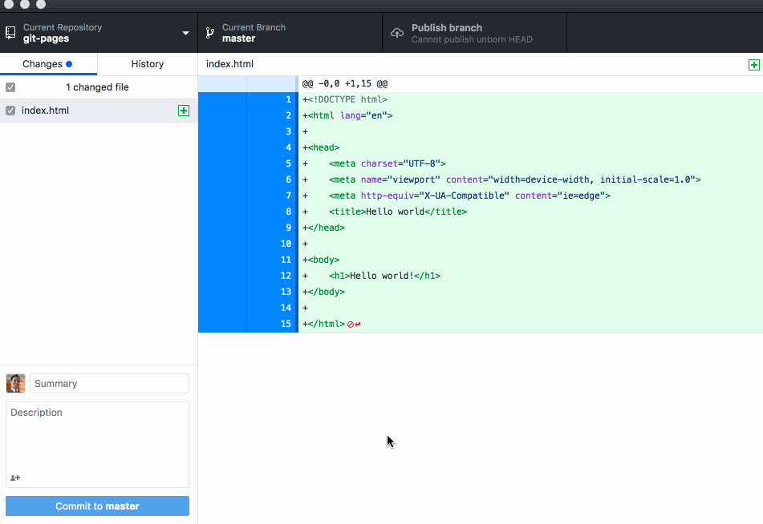
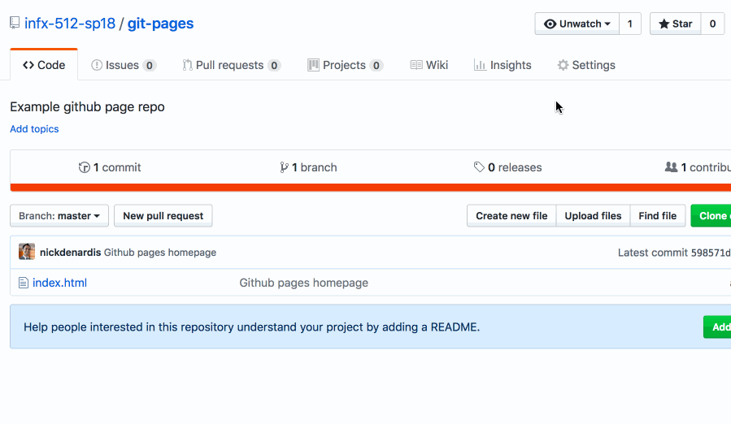

# Publishing to GitHub pages

You can configure GitHub Pages to publish your site's source files from master, gh-pages, or a /docs folder on your master branch for Project Pages and other Pages sites that meet certain criteria.

If your site is a User or Organization Page that has a repository named `<username>.github.io or <orgname>.github.io`, you cannot publish your site's source files from different locations. User and Organization Pages that have this type of repository name are only published from the master branch.

## Create a branch to publish

After you've created either a master or gh-pages branch, you can set one as your publishing source so that your site will be published.

If you fork or upload your site repository with only a master or gh-pages branch, your site's source setting will automatically be enabled for that branch.

## Create an index.html page

## Push the master branch to GitHub

## Change setting in GitHub

## View the page in a browser

https://[orgname].github.io/[reponame]

## Source

- [GitHub Help Pages](https://help.github.com/en/articles/configuring-a-publishing-source-for-github-pages)