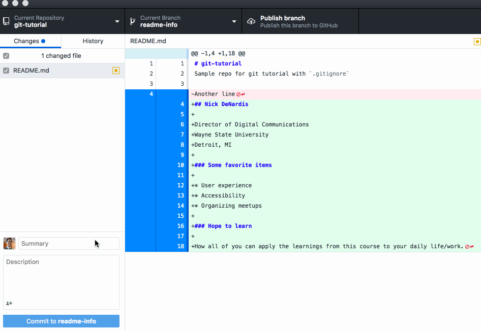
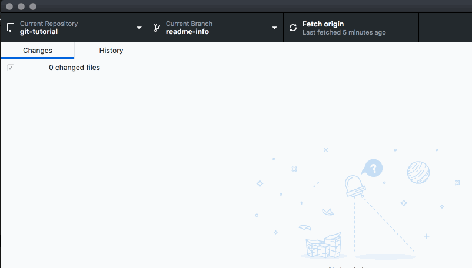

# GitHub Branching and Merging

<iframe width="560" height="315" src="https://www.youtube.com/embed/EmF35TSzBG4" frameborder="0" allow="accelerometer; autoplay; encrypted-media; gyroscope; picture-in-picture" allowfullscreen></iframe>

## Working collaboratively

Often code is not created in isolation, especially if it is open source. Some time you want to work on a feature or some part of the code that may not work out and need

## Branching and Merging

Once you have added content, commit those changes and publish them to GitHub.

## Pull Requests

## Merging in a pull request

## Pull newest changes to your desktop

## Keep Practicing

This is a great time to experiment with the process of changing code, committing the code through the GitHub Desktop application and pushing it to the server. The number of commits you have in a repository is not important. At this point it is important to get the process down, as all future assignments will require changes to code inside a repository that is pushed to GitHub.

## Additional resources

- [About forks](https://help.github.com/en/articles/about-forks)
- [Creating a pull request from a fork](https://help.github.com/en/articles/creating-a-pull-request-from-a-fork)
