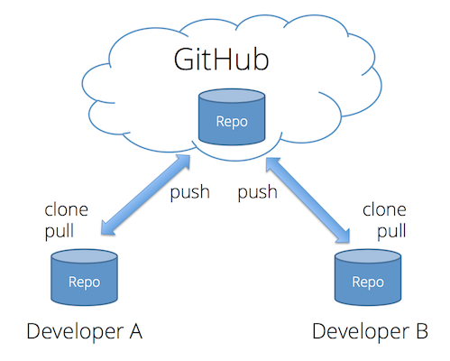
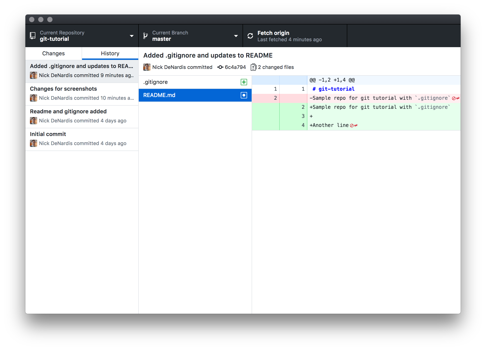
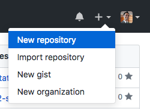
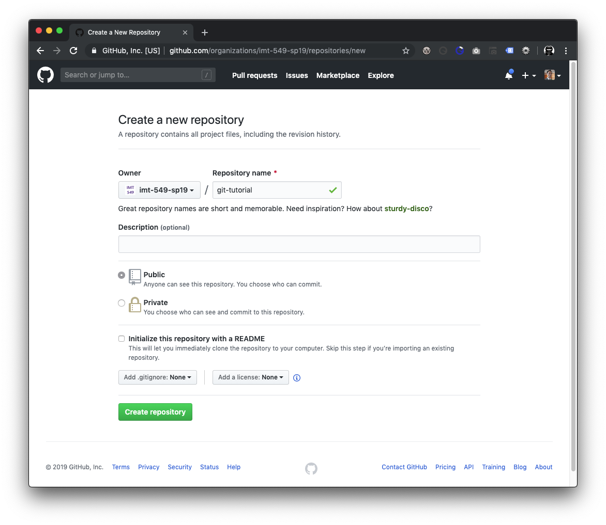
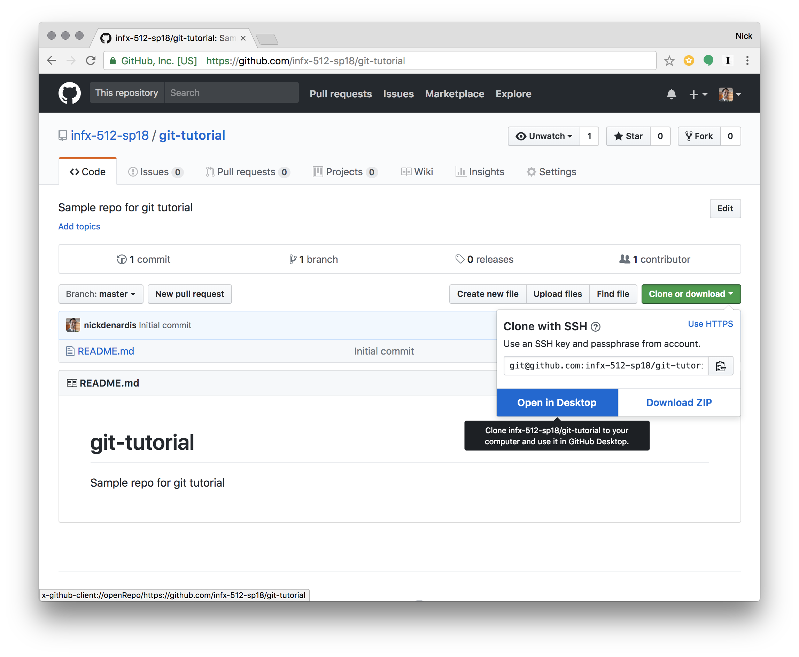
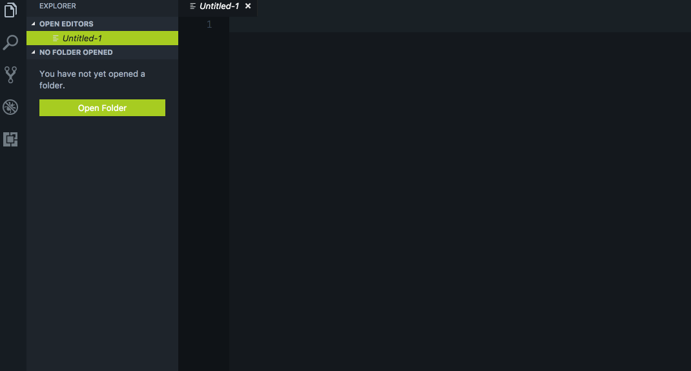
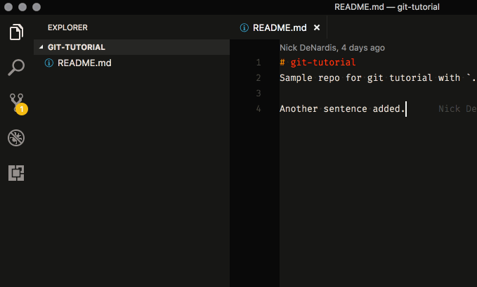
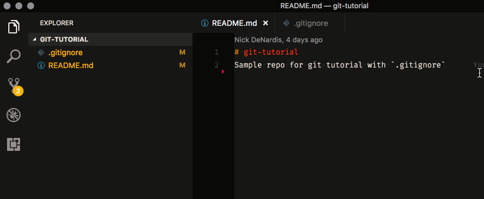
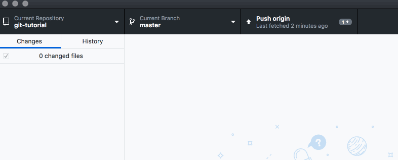

# Managing files tutorial

<iframe width="560" height="315" src="https://www.youtube.com/embed/q3e4eYHpO-k" frameborder="0" allow="accelerometer; autoplay; encrypted-media; gyroscope; picture-in-picture" allowfullscreen></iframe>

Website consist of many files, folders and assets. These files are living documents that change over time.

## Version control systems

- CVS (Concurrent Version Systems) - 1900's
- SVN (Apache Subversion) - 2000's
- Git/Mercurial - 2005

### CVS & SVN - Centralized Version Control

One central server, each client (person) checks out and merges changes to main server.

## Git, Mercurial - Distributed Version Control

Each client (person) has a local repository (sometimes shortened to 'repo'), which they can then reconcile with the main server.

## GitHub

Although `git` can be used without a central server, it is commonly paired with the collaborative, cloud-based repository service GitHub, which maintains a copy of your files in a central, secure, and backed-up location.

- Fast -- add to your team and code base quickly
- Distributed
- Each commit has a corresponding hash (track changes from everyone)
- Everyone has a local copy of the history

Git is an archiving system that can store, retrieve, and merge various versions of your files. It's kind of like Dropbox and Google Docs, but with two big differences:

- New versions of your files must be explicitly committed when they are ready. Git doesn't save a new version every time you save a file to disk. That approach works fine for word-processing documents, but not for programming files. You typically need to write some code, save it, load it in your browser, test it, debug, make some fixes, and test again before you're ready to commit a new version.
- For text files (which nearly all your web development files will be), git pays attention to changes at the line level, and not just the file level. That means it can automatically merge together different changes made to different parts of the same file.

Like Dropbox and Google Docs, git can show you all previous versions of a file and can quickly rollback to one of those previous versions. This is often helpful in web development, especially if you embark on making a massive set of changes, only to discover part way through that those changes were a bad idea (I speak from experience here 😱).

But where git really comes in handy is in team development. Almost all professional web development work is done in teams, with involves multiple people working on the same set of files at the same time. Git helps the team coordinate all these changes, and provides a record so that anyone can see how a given file ended up the way it did.

## Git Core Concepts

To understand how git works, you need to understand its core concepts. Read this section carefully, and come back to it if you forget what these terms mean.

- **repository (repo)**: an archive containing all the committed versions of all your files, along with some additional metadata, stored in a hidden subdirectory named `.git` within your project directory. If you want to sound cool and in-the-know, call this a "repo."
- **commit**: a set of file versions that have been added to the repository, along with the name of the person who did the commit, a message describing the commit, and a timestamp. This extra tracking information allows you to see when, why, and by whom changes were made to a given file.
- **remote**: a link to a copy of this same repository on a different machine. Typically this will be a central version of the repository that all local copies on your various development machines point to (known as the `origin`). You can push/publish commits to, and pull commits from, a remote repository to keep everything in sync. You can also add more than one remote link if you are working with multiple remote repositories.
- **merge conflict**: a condition that occurs when you merge commits pulled from a remote repository that include changes to the same lines that you've already changed locally. In this case, git doesn't which version is correct, so you must resolve the conflict by choosing a winner, or manually combining the changes.
- **.gitignore file**: a file in your project's root directory that contains paths or specific files that git should ignore. This is very useful for keeping things out of the repository that should never be in there, such as current workspace settings saved by an Integrated Development Environment (IDE), or files containing login information or secret keys.

## GitHub Desktop

Git can be used as a command line tool (see [Getting setup page](./getting-setup)). In this course we will be using the GitHub Desktop application to manage our repositories, files and commits.

## Working with repositories

### Create a new repository

Sign in to your GitHub account and click the "+" button in the header to create a new repository.

Fill out the information about the repository. For the name, it is a best practice to use only two to three words, all lowercase and dashes to separate words.

### Clone an existing repository

Now that the repository is created, it is time to get it connected to a folder on your computer. This process is called cloning. Click the "Clone or download" button and choose the "Open in Desktop" link. This will pop open a dialog to ask for permissions to open in the desktop application.

Once in the application, it will ask you where to store the files on your computer. I recommend creating a folder at `/Users/{username}/Sites/imt-549/` to store all your repositories for this course.

### If the "Open in GitHub Desktop" button doesn't work

On some computers, the "Open in GitHub Desktop" button doesn't work from the browser. You can clone a repository from the GitHub Desktop application itself. I've included a video to demonstrate the process.

## Open in VS Code

Once the code has been downloaded to your computer, it is time to open VSCode and open that folder.

Note: If you see a `.git` folder in the repo, that folder contains the meta data for the repository, not your actual files.

Choose the folder you cloned, `/Users/{username}/Sites/imt-529/{repo-name}`.

You will notice VSCode does have the ability to work with the repository to see differences, commit code and push it to GitHub, like the GitHub Desktop app. We will be using the GitHub Desktop app moving forward in this course, because it is a dedicated app that is clear what is going on with the repo.

There are many applications that work with GIT repositories, individuals and companies standardize on an application that makes them most productive.

## Create a .gitignore file

Now let's add some files to our project, the first is a special file, `.gitignore`. This file is formatted in plain text with a filename or folder path on each line. The first item we are going to add is `.DS_Store`, a file that Mac OS adds to every folder to keep track of settings and options.

Since this file is personal to your computer and doesn't have any value living with the code of a website, we will ignore it to ensure it does not get committed and pushed to GitHub.

Another file you will commonly see in the `.gitignore` file is `node_modules`, late in the course we will get into installing code from npm, a repository of open source tools that can be used on any project. We would ignore duplicating those files and pushing them into our repository.

## Edit the README.md file

GitHub and other code storage websites use a filetype called Markdown. It is a way to express document formatting with regular characters and when viewed on these websites, the file is converted to HTML to view with formatting.

This special `README.md` file in the root of the project is automatically displayed to users in GitHub as they are browsing your code.

In addition, this file is where developers can document various things about a project or code. The best `README.md` files have a consistent format, an example: templates.

## Preview the rendered markdown file

There is a button in the top-right of VSCode when editing a markdown file to "preview" the rendered HTML of the file. This is helpful to ensure your expected formatting is rendered correctly in HTML.

Note that VSCode graphically shows a gutter bar next to the lines that have been added. It uses git to determine which lines have changed within the current file. Lines that were removed, show a small wedge to indicate where lines were previously.

## Commit changes

Once the changes have been made, it is time to commit the changes to make a 'save point' with a comment about what has changed.

All files changed will show in the "Changes" area. Select the files that you want to be saved, you don't have to choose every file, but most of the time you will.

Writing a good commit message is an art, being concise while still explaining what changed and why is important. The Summary, the first line, should complete this sentence: "if applied, this commit will Add instructions to the README." The emphasized words in this sentence will make an appropriate commit message.

The Description is a larger area to explain in more detail why the change was needed, any side effects the code will produce and link to any issues it resolves or where the change was requested. This description area should be formatted in Markdown.

## Viewing the commit history

The list of changes should disappear and a message should be shown indicating that the commit was completed. Note that you click the Undo button to undo that commit if you decided it was a bad idea.

## Push to origin (Github)

After making one or more commits is it good practice to push the changes to the central GIT repository (In our case, GitHub). This will publish all the changes so other developers can pull them down and work off the updated code.

## View changes on Github

Now that the changes have been pushed, visiting the repository on GitHub should show all the changes made.

## Repeat

This process can seem a bit straining at first, especially when coming from the process in desktop application or Google Web apps, where changes are saved in real time or without comments. After going through this course you will have an understanding of why this process is important. Thinking of changes to a codebase as "snapshots" in time allows you as a developer to isolate a bundle of changes (HTML, CSS, Images, etc) around a description and moving between each state in the code changes all the necessary files at once.

## Additional resources

- [GitHub Desktop how-to guides](https://help.github.com/en/desktop/contributing-to-projects)
- [GitHub "Hello world" activity](https://guides.github.com/activities/hello-world/)
- [How to Write a Git Commit Message](https://chris.beams.io/posts/git-commit/)
- [VSCode intro videos](https://code.visualstudio.com/docs/getstarted/introvideos)
- [Markdown guide](https://guides.github.com/features/mastering-markdown/)
